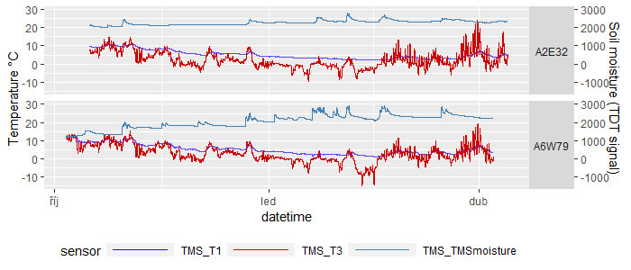

# 2023_SoilTemp_virtual
Introducing myClim an R package for microclimatic data handling. 

## Install 
```
requiered_packages <- c("stringr", "lubridate", "tibble", "dplyr", "purrr",
                        "ggplot2", "ggforce", "viridis", "runner",
                        "rmarkdown", "knitr", "kableExtra", "tidyr", "plotly", "zoo")
missing_packages <- requiered_packages[!(requiered_packages %in% installed.packages()[,"Package"])]
if(length(missing_packages)) install.packages(missing_packages)

install.packages("http://labgis.ibot.cas.cz/myclim/myClim_latest.tar.gz", repos=NULL, build_vignettes=TRUE)
```

## Reading logger data with metadata

```
library(myClim)

ft<-read.table("files_table.csv",sep=",",header = T)
lt<-read.table("localities_table.csv",sep=",",header = T)

tms <- mc_read_data(files_table = "files_table.csv",
                      localities_table =lt,
                      silent = T,clean = T)
```

## Plotting 
```
mc_plot_line(tms,sensors = c("TMS_T3","TMS_T1","TMS_TMSmoisture"))
```

```
mc_plot_raster(tms,sensors = c("TMS_T3"))
```


## Aggregation in time

```
# aggregate to daily mean, range, coverage, and 95 percentile. 
tms.week <- mc_agg(tms, fun=c("mean","range","coverage","percentile"),
                percentiles = 95, period = "week",min_coverage = 0.8)

mc_plot_raster(tms.week,sensors = c("TMS_T3_mean"))

# aggregate all time-series, return one value per sensor.
tms.all <- mc_agg(tms, fun=c("mean","range","coverage","percentile"),
                percentiles = 95, period = "all",min_coverage = 0.8)
r<-mc_reshape_long(tms.all)
```


## Standard myClim variables

```
temp_env <- mc_env_temp(tms,period="all",min_coverage = 0.8)
```
